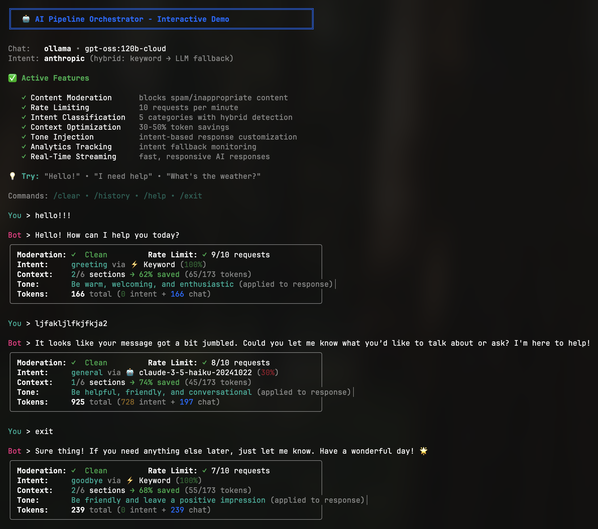

<div align="center">

# AI Pipeline Orchestrator

Build production-ready AI chatbots with composable handler pipelines. Handles intent detection, context optimization, token management, rate limiting, and moderation out of the box.

[](https://www.npmjs.com/package/ai-pipeline-orchestrator)
[](https://github.com/emmanuel-adu/ai-pipeline-orchestrator/actions)
[](https://opensource.org/licenses/MIT)
[](https://www.typescriptlang.org/)
[](https://www.npmjs.com/package/ai-pipeline-orchestrator)

</div>

---

<p align="center">
  
</p>

<p align="center">
  <em>Interactive CLI demo showcasing hybrid intent detection, context optimization, and real-time streaming</em><br>
  <a href="#demo-screenshots">View detailed screenshot</a>
</p>

---

## Features

| Feature | Description |
|---------|-------------|
| **Sequential Pipelines** | Compose handlers that run in order with automatic error handling |
| **Hybrid Intent Detection** | Keyword matching (fast, free) -> LLM fallback (accurate, paid) |
| **Context Optimization** | Load only relevant context based on intent (30-50% token savings) with automatic tone injection |
| **Dynamic Context Loading** | Load contexts from database/CMS with caching and versioning |
| **Real-Time Streaming** | Stream AI responses as they're generated for better UX |
| **Token Usage Tracking** | Automatic token counting and usage breakdown for cost monitoring |
| **Multi-Provider** | Works with Anthropic, OpenAI, or Ollama (local/cloud) |
| **Production Ready** | Rate limiting, moderation, logging, error handling, analytics hooks, step performance tracking |
| **Custom Handlers** | Build your own handlers with full TypeScript support |
| **TypeScript** | Full type safety with minimal dependencies (just Zod) |

## Installation

```bash
npm install ai-pipeline-orchestrator
```

Install a provider SDK:

```bash
# Anthropic (recommended)
npm install @ai-sdk/anthropic ai

# OpenAI
npm install @ai-sdk/openai ai

# Ollama (free, local/cloud)
npm install ai-sdk-ollama ai
```

## Quick Start

```typescript
import { executeOrchestration, createAIHandler } from 'ai-pipeline-orchestrator'

const result = await executeOrchestration(
  {
    request: {
      messages: [{ role: 'user', content: 'Tell me a joke' }],
    },
  },
  [
    {
      name: 'ai',
      handler: createAIHandler({
        provider: 'anthropic',
        model: 'claude-3-5-haiku-20241022',
        apiKey: process.env.ANTHROPIC_API_KEY,
        getSystemPrompt: () => 'You are a helpful assistant.',
      }),
    },
  ]
)

console.log(result.context.aiResponse.text)
```

## Providers

### Supported Providers

| Provider | Package | Models | API Key | Best For |
|----------|---------|--------|---------|----------|
| **Anthropic** | `@ai-sdk/anthropic` | `claude-3-5-haiku-20241022`<br/>`claude-3-5-sonnet-20241022` | [Get key](https://console.anthropic.com) | Production, high-quality responses |
| **OpenAI** | `@ai-sdk/openai` | `gpt-4o-mini`<br/>`gpt-4o` | [Get key](https://platform.openai.com) | Production, wide model selection |
| **Ollama** | `ai-sdk-ollama` | `llama3.2`, `deepseek-r1`, `qwen2.5`<br/>100+ more | Optional ([Cloud](https://ollama.com)) | Development, cost savings, offline |

### Provider Setup

<details>
<summary><strong>Anthropic / OpenAI</strong></summary>

```bash
# .env
AI_PROVIDER=anthropic
AI_MODEL=claude-3-5-haiku-20241022
ANTHROPIC_API_KEY=your-key-here
```

</details>

<details>
<summary><strong>Ollama Local</strong></summary>

```bash
# Install and run
curl -fsSL https://ollama.com/install.sh | sh
ollama serve
ollama pull llama3.2

# .env
AI_PROVIDER=ollama
AI_MODEL=llama3.2:latest
OLLAMA_BASE_URL=http://localhost:11434
```

</details>

<details>
<summary><strong>Ollama Cloud (Free Tier)</strong></summary>

```bash
# .env
AI_PROVIDER=ollama
AI_MODEL=llama3.2:latest
OLLAMA_BASE_URL=https://ollama.com
OLLAMA_API_KEY=your-key-here  # Get from https://ollama.com
```

</details>

<details>
<summary><strong>💡 Hybrid Setup (Recommended)</strong></summary>

Use a cloud provider for chat (best quality) + Ollama for intent classification (free):

```bash
# .env
AI_PROVIDER=anthropic
AI_MODEL=claude-3-5-haiku-20241022
ANTHROPIC_API_KEY=your-key-here

INTENT_PROVIDER=ollama
INTENT_MODEL=deepseek-r1:latest
OLLAMA_BASE_URL=http://localhost:11434
```

This gives you high-quality chat responses with zero-cost intent classification.

</details>

## Usage

### Pipeline Orchestration

Handlers run sequentially, passing context between them:

```typescript
import {
  executeOrchestration,
  createModerationHandler,
  createIntentHandler,
  createContextHandler,
  createAIHandler,
} from 'ai-pipeline-orchestrator'

const result = await executeOrchestration(
  context,
  [
    { name: 'moderation', handler: createModerationHandler() },
    { name: 'intent', handler: createIntentHandler({ classifier }) },
    { name: 'context', handler: createContextHandler({ optimizer }) },
    { name: 'ai', handler: createAIHandler({ provider, model, apiKey }) },
  ],
  {
    logger: myLogger,
    onStepComplete: (step, duration) => console.log(`${step}: ${duration}ms`),
  }
)
```

If any handler sets `context.error` or throws, the pipeline stops.

#### Class-based Orchestrator (for stateful pipelines)

```typescript
import { Orchestrator } from 'ai-pipeline-orchestrator'

const orchestrator = new Orchestrator(
  [
    { name: 'moderation', handler: createModerationHandler() },
    { name: 'intent', handler: createIntentHandler({ classifier }) },
    { name: 'ai', handler: createAIHandler({ provider, model, apiKey }) },
  ],
  {
    logger: myLogger,
    onStepComplete: (step, duration) => console.log(`${step}: ${duration}ms`),
  }
)

// Execute multiple times with same configuration
const result1 = await orchestrator.execute(context1)
const result2 = await orchestrator.execute(context2)

// Dynamically manage handlers
orchestrator.addHandler({ name: 'rateLimit', handler: createRateLimitHandler() })
orchestrator.toggleStep('moderation', false) // Disable moderation
orchestrator.removeHandler('intent') // Remove intent handler
```

### Handlers

#### Content Moderation

```typescript
import { createModerationHandler } from 'ai-pipeline-orchestrator'

const handler = createModerationHandler({
  spamPatterns: ['buy now', 'click here'],
  customRules: [{ pattern: /badword/i, reason: 'Profanity detected' }],
})
```

#### Rate Limiting

Bring your own rate limiter (Upstash, Redis, etc):

```typescript
import { createRateLimitHandler } from 'ai-pipeline-orchestrator'

const handler = createRateLimitHandler({
  limiter: {
    check: async (id) => ({
      allowed: await checkLimit(id),
      retryAfter: 60, // seconds
    }),
  },
  identifierKey: 'userId',
})
```

#### Intent Detection

Three modes: keyword-only, LLM-only, or hybrid.

<details>
<summary><strong>Keyword-based</strong> (fast, free)</summary>

```typescript
import { IntentClassifier, createIntentHandler } from 'ai-pipeline-orchestrator'

const classifier = new IntentClassifier({
  patterns: [
    { category: 'greeting', keywords: ['hello', 'hi', 'hey'] },
    { category: 'help', keywords: ['help', 'support'] },
  ],
})

const handler = createIntentHandler({ classifier })
```

</details>

<details>
<summary><strong>LLM-based</strong> (accurate, paid)</summary>

```typescript
import { LLMIntentClassifier, createIntentHandler } from 'ai-pipeline-orchestrator'

const classifier = new LLMIntentClassifier({
  provider: 'anthropic',
  model: 'claude-3-5-haiku-20241022',
  apiKey: process.env.ANTHROPIC_API_KEY,
  categories: ['greeting', 'help', 'question'],
  categoryDescriptions: {
    greeting: 'User says hello',
    help: 'User needs help',
    question: 'User asks a question',
  },
})

const handler = createIntentHandler({ classifier })
```

</details>

<details>
<summary><strong>Hybrid</strong> (best of both)</summary>

```typescript
const handler = createIntentHandler({
  classifier: keywordClassifier,
  llmFallback: {
    enabled: true,
    classifier: llmClassifier,
    confidenceThreshold: 0.5, // use LLM if keyword confidence < 0.5
  },
})
```

</details>

#### Context Optimization

Context optimization automatically loads relevant context sections and injects tone-specific instructions based on detected intent.

##### Static Context

Load only relevant context based on intent with tone injection:

```typescript
import { ContextOptimizer, createContextHandler } from 'ai-pipeline-orchestrator'

const optimizer = new ContextOptimizer({
  sections: [
    {
      id: 'core',
      content: 'You are a helpful assistant.',
      alwaysInclude: true,
    },
    {
      id: 'help',
      content: 'Help documentation...',
      topics: ['help', 'support'],
    },
  ],
  strategy: {
    firstMessage: 'full',
    followUp: 'selective',
  },
  toneInstructions: {
    friendly: 'Be warm and approachable',
    professional: 'Be formal and concise',
  },
})

const handler = createContextHandler({
  optimizer,
  getTopics: (ctx) => [ctx.intent?.intent],
  getTone: (ctx) => ctx.intent?.metadata?.tone, // Tone from intent metadata
})
```

**How tone works:**
- Intents can have associated tones (`greeting` -> `"Be warm, welcoming, and enthusiastic"`)
- The tone is automatically injected into the system prompt via `toneInstructions`
- This enables dynamic response customization without hardcoding tone in every prompt

##### Dynamic Context

Load context from database with versioning:

```typescript
import {
  createDynamicContextHandler,
  TTLCache,
  type ContextLoader,
} from 'ai-pipeline-orchestrator'

// Implement your context loader
class DatabaseContextLoader implements ContextLoader {
  async load(topics: string[], variant?: string) {
    const contexts = await db.contexts.findMany({
      where: { variant, topics: { hasSome: topics } },
    })
    return contexts
  }
}

// Setup cache with 5-minute TTL
const cache = new TTLCache(5 * 60 * 1000)

const handler = createDynamicContextHandler({
  loader: new DatabaseContextLoader(),
  cache,
  getTopics: (ctx) => [ctx.intent?.intent],
  getTone: (ctx) => ctx.intent?.metadata?.tone,
  // Simple variant selection - bring your own A/B testing tool
  getVariant: (ctx) => {
    // Environment-based
    return process.env.PROMPT_VARIANT

    // Or use LaunchDarkly, Optimizely, etc.
    // return launchDarkly.variation('prompt-version', ctx.userId, 'control')
  },
  onVariantUsed: (data) => {
    // Track with your analytics tool
    analytics.track('variant_used', data)
  },
  // Optional: fallback optimizer if loader fails
  // fallbackOptimizer: optimizer,
})
```

#### AI Generation

<details>
<summary><strong>Non-streaming</strong></summary>

```typescript
import { createAIHandler } from 'ai-pipeline-orchestrator'

const handler = createAIHandler({
  provider: 'anthropic',
  model: 'claude-3-5-sonnet-20241022',
  apiKey: process.env.ANTHROPIC_API_KEY,
  temperature: 0.7,
  maxTokens: 1024,
  getSystemPrompt: (ctx) => ctx.promptContext?.systemPrompt || 'You are a helpful assistant.',
})
```

</details>

<details>
<summary><strong>Streaming</strong></summary>

```typescript
import { createStreamingAIHandler } from 'ai-pipeline-orchestrator'

const handler = createStreamingAIHandler({
  provider: 'anthropic',
  model: 'claude-3-5-sonnet-20241022',
  apiKey: process.env.ANTHROPIC_API_KEY,
  onChunk: (chunk) => sendToClient(chunk),
})

// Full text still available after streaming
console.log(result.context.aiResponse.text)
```

</details>

#### Custom Handlers

```typescript
import { OrchestrationHandler } from 'ai-pipeline-orchestrator'

const authHandler: OrchestrationHandler = async (context) => {
  const userId = context.request.metadata?.userId

  if (!userId) {
    return {
      ...context,
      error: {
        message: 'Authentication required',
        statusCode: 401,
        step: 'auth',
      },
    }
  }

  return { ...context, user: await fetchUser(userId) }
}
```

## Try the Interactive Demo

```bash
git clone https://github.com/emmanuel-adu/ai-pipeline-orchestrator.git
cd ai-pipeline-orchestrator
npm install

# Configure (copy .env.example to .env and add your API key)
cp .env.example .env

# Run the demo
npm run example:chat
```

The demo showcases all features in real-time:

- Content moderation
- Rate limiting
- Hybrid intent classification
- Context optimization (30-50% token savings)
- Real-time streaming
- Token usage breakdown

## API Reference

### Core

| Export | Description |
|--------|-------------|
| `executeOrchestration(context, steps, config?)` | Run the pipeline |
| `Orchestrator` | Class-based version for stateful pipelines |
| `OrchestrationHandler` | Handler function type |
| `OrchestrationContext` | Context object passed between handlers |

### Intent

| Export | Description |
|--------|-------------|
| `IntentClassifier` | Keyword-based detection |
| `LLMIntentClassifier` | LLM-based detection with structured output |
| `createIntentHandler(config)` | Creates intent handler |

### Context

| Export | Description |
|--------|-------------|
| `ContextOptimizer` | Smart context selection (static) |
| `createContextHandler(config)` | Creates context handler (static) |
| `createDynamicContextHandler(config)` | Creates dynamic context handler with caching |
| `ContextLoader` | Interface for loading contexts from external sources |
| `StaticContextLoader` | Simple in-memory context loader |
| `TTLCache` | Time-to-live cache utility |

### AI

| Export | Description |
|--------|-------------|
| `createAIHandler(config)` | Text generation |
| `createStreamingAIHandler(config)` | Streaming generation |

### Utilities

| Export | Description |
|--------|-------------|
| `createRateLimitHandler(config)` | Rate limiting |
| `createModerationHandler(config)` | Content moderation |

## Examples

Check out the [examples](./examples) directory:

- [`basic-chatbot.ts`](./examples/basic-chatbot.ts) - Minimal working example
- [`complete-chatbot.ts`](./examples/complete-chatbot.ts) - All features combined
- [`streaming-chatbot.ts`](./examples/streaming-chatbot.ts) - Streaming responses
- [`dynamic-context.ts`](./examples/dynamic-context.ts) - Dynamic context loading with versioning
- [`all-handlers.ts`](./examples/all-handlers.ts) - Complete production pipeline
- [`chat-cli.ts`](./examples/chat-cli.ts) - Interactive CLI demo

### Running Examples

Run any example using npm scripts:

```bash
# Interactive CLI demo (recommended for first-time users)
npm run example:chat

# Minimal working example
npm run example:basic

# Complete chatbot with all features
npm run example:complete

# Streaming responses
npm run example:streaming

# Dynamic context loading
npm run example:dynamic-context

# All handlers demonstration
npm run example:all
```

Make sure you have your `.env` file configured with API keys before running examples.

### Demo Screenshots

<details>
<summary>📸 Click to see detailed CLI output</summary>

<p align="center">
  
</p>

*Interactive CLI showcasing hybrid intent detection (keyword → LLM fallback), context optimization with 30-74% token savings, tone injection, real-time streaming, and comprehensive metadata display after each response.*

</details>

## Contributing

Contributions are welcome! Please read [CONTRIBUTING.md](./CONTRIBUTING.md) for guidelines.

## License

MIT © [Emmanuel Adu](https://github.com/emmanuel-adu)
